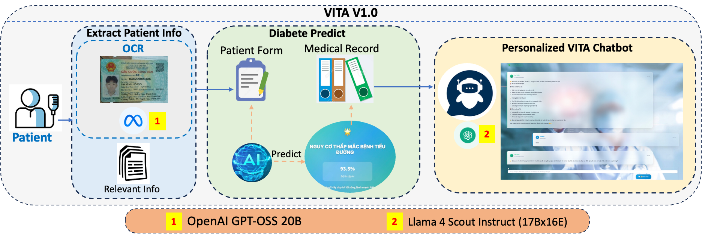
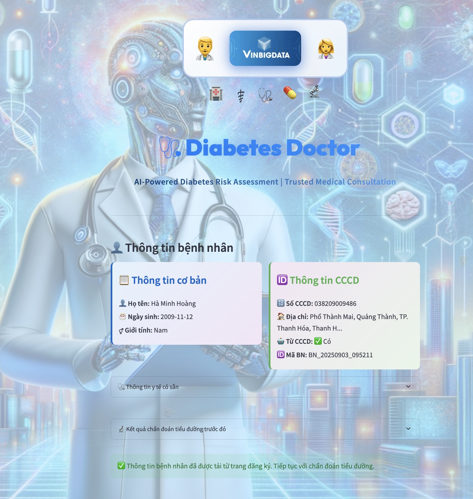
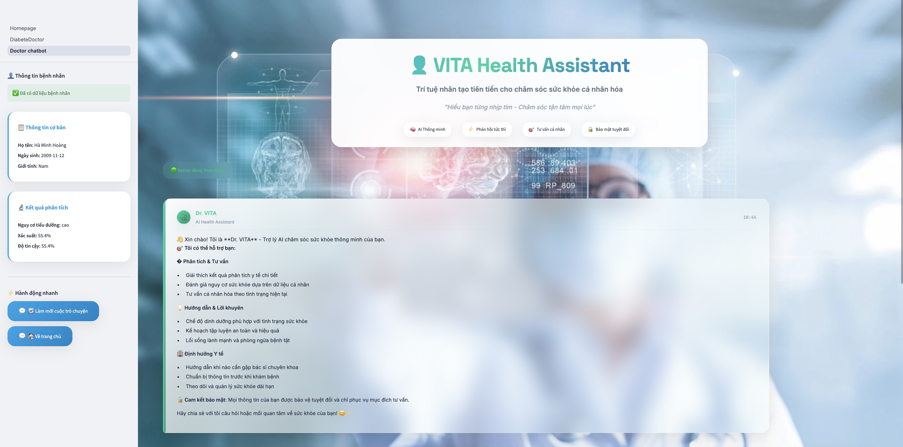
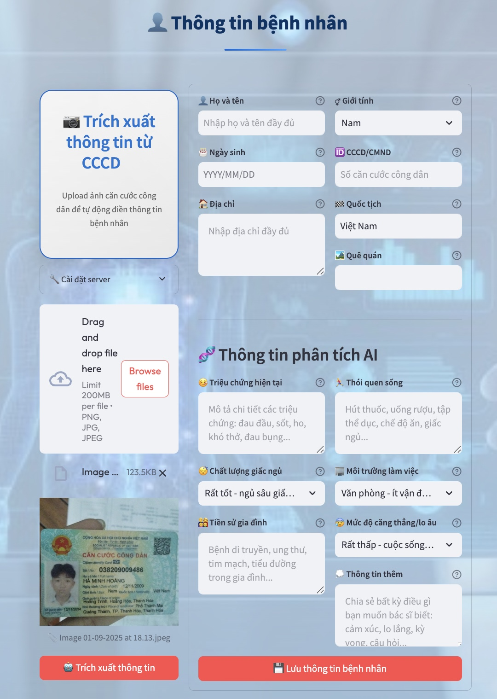
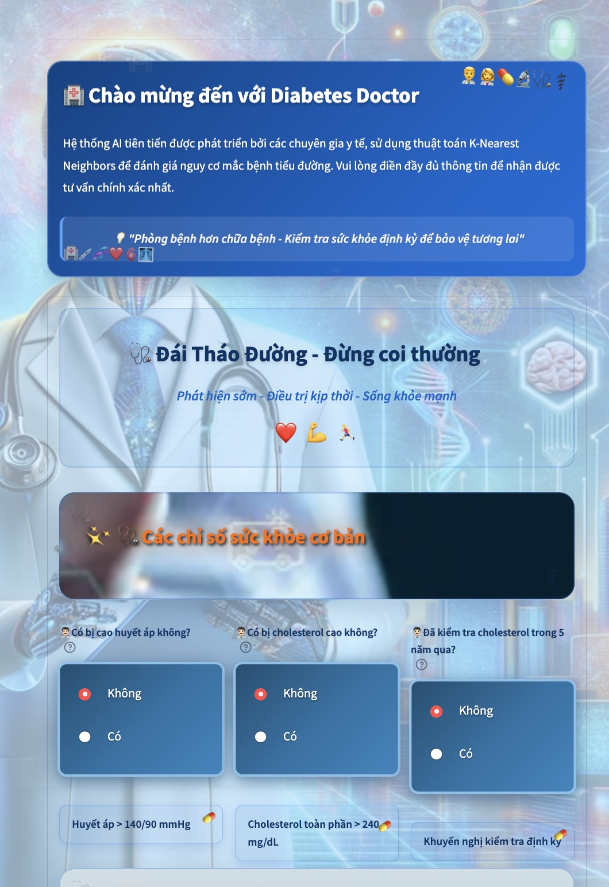
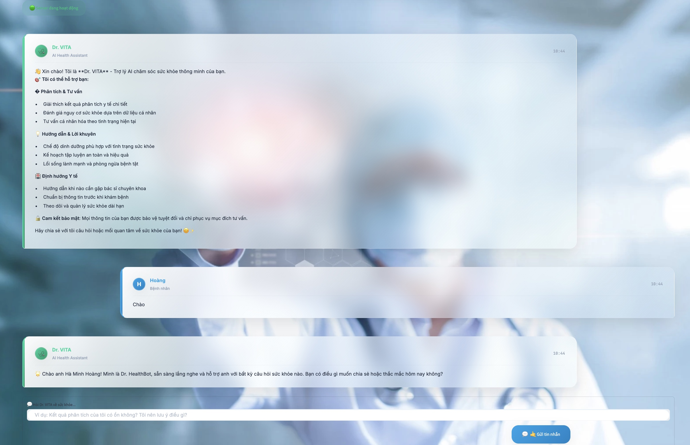
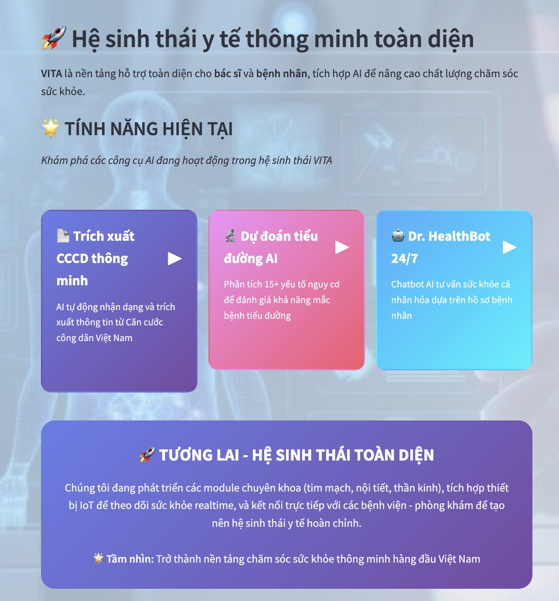
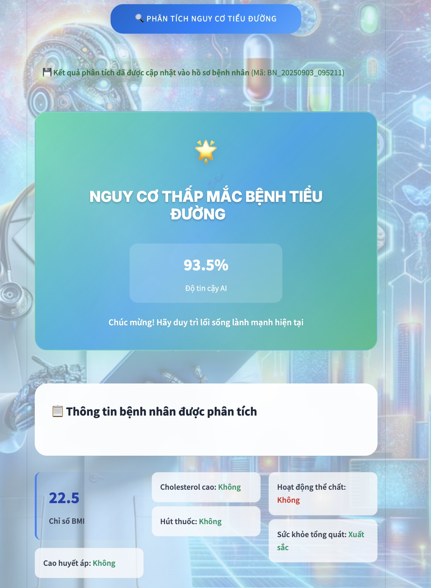
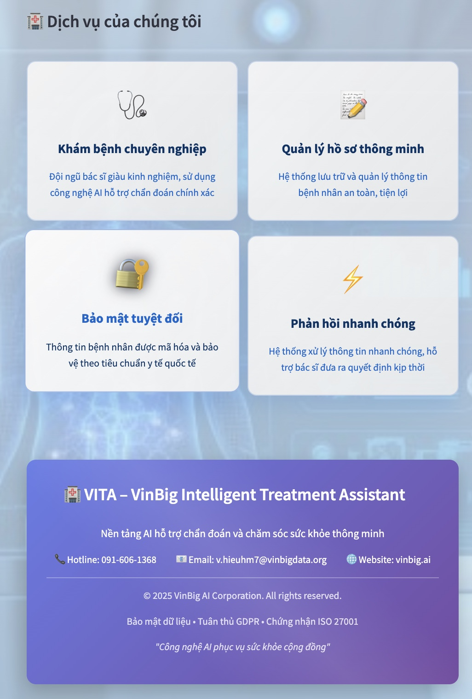

# 🌟 VITA - VinBig Intelligent Treatment Assistant -

> 💡 *AI thông minh – Đồng hành cùng sức khỏe của bạn*  


---

## 🎯 Giới thiệu  

**VITA** là nền tảng **trợ lý y tế thông minh** do **VinBig AI** phát triển, ứng dụng công nghệ AI tiên tiến để:  
- **Hỗ trợ bác sĩ** trong phân tích, chẩn đoán và ra quyết định điều trị  
- **Cá nhân hóa chăm sóc sức khỏe** cho từng người dùng  
- **Đồng hành lâu dài** trong việc theo dõi, phòng ngừa và cải thiện sức khỏe cộng đồng  

---
## 📢 Thông báo phiên bản  
### 🎉 07/09/2025: VITA Phiên bản 1.1
  

## 🚀 Tính năng chính  

- 🩺 **Phân tích nguy cơ sức khỏe** (tiểu đường, bệnh mãn tính) với độ chính xác cao  
- 💬 **Chatbot tư vấn y tế thông minh** – hội thoại tự nhiên, thân thiện và cá nhân hóa  
- 🆔 **Nhận dạng CCCD tự động** – nhập liệu nhanh chóng, chính xác và bảo mật  
- 📊 **Theo dõi & quản lý sức khỏe cá nhân** – chủ động hơn trong hành trình chăm sóc bản thân  

---

## 🔬 Công nghệ AI tích hợp  

- Ứng dụng **AI toàn diện trong y tế**: từ xử lý ngôn ngữ, phân tích dữ liệu đến hỗ trợ lâm sàng  
- Hệ thống **linh hoạt, dễ mở rộng**, sẵn sàng tích hợp thêm nhiều tính năng mới  
- **Tuân thủ chuẩn bảo mật quốc tế**, đảm bảo an toàn dữ liệu người dùng  

---

## 🎯 Sứ mệnh  

VITA hướng đến việc trở thành **người bạn đồng hành tin cậy của bác sĩ và bệnh nhân**,  
mang lại trải nghiệm y tế **an toàn – chính xác – hiệu quả**,  
góp phần xây dựng một **tương lai khỏe mạnh hơn cho tất cả mọi người**.  

---

## 📢 Thông báo phiên bản  

### 🎉 VITA Version 1.1 - Hiện đã có mặt!  
**📅 Ngày phát hành: 07 tháng 09 năm 2025**  
  

## 🖼️ Giao diện ứng dụng  

### 🏠 Trang chủ  
  

### 🩺 Phân tích nguy cơ tiểu đường  
  

### 💬 Chatbot tư vấn y tế  
  

### 📱 Các tính năng khác  
<p align="center">
  
  
  
</p>  

---

## 🚀 Hướng dẫn cài đặt và sử dụng  

### 📋 Yêu cầu  
- **Python 3.9** trở lên  
- **4GB RAM** trở lên  
- **Kết nối internet** để sử dụng AI  

### 🛠️ Cài đặt  

**Bước 1: Clone dự án**  
```bash
git clone https://github.com/langkhachhoha/vita-health-assistant.git
cd vita-health-assistant


# Cài đặt các thư viện cần thiết
pip install -r Doctor_app/requirements.txt
```

## ⚙️ Cấu hình môi trường (.env)

Ứng dụng **VITA** cần một file cấu hình `.env` để kết nối với các dịch vụ AI trên **FPT Cloud Marketplace**.  

👉 Tạo file `.env` trong thư mục gốc của **Doctor_app** với nội dung mẫu sau:

```bash
# API Configuration for Health Chatbot
BASE_URL=https://mkp-api.fptcloud.com
MODEL_NAME=gpt-oss-20b             # Model cho Chatbot Y tế

# API Configuration for OCR
OCR_MODEL_NAME=llama-4-scout-17b-16e   # Model cho OCR CCCD

# Server Configuration
CHATBOT_SERVER_HOST=localhost
CHATBOT_SERVER_PORT=8502

# FPT API Key
FPT_API_KEY=your_api_key_here
```

### 🎮 Cách chạy hệ thống

Mở **1 terminal** và chạy lần lượt các lệnh sau để khởi động toàn bộ hệ thống:

```bash
# Chạy server OCR CCCD
python Doctor_app/cccd_ocr_server.py

# Chạy server phân tích tiểu đường
python Doctor_app/DiabeteDoctor-Server.py

# Chạy server Chatbot y tế
python Doctor_app/Doctor_chatbot_server.py

# Cuối cùng, chạy giao diện chính
streamlit run Doctor_app/Homepage.py
```

➡️ **Truy cập:** http://localhost:8501
  

### 🐳 **Cách sử dụng**

#### **🏠 Trang chủ**
- Chọn chức năng muốn sử dụng từ menu bên trái

#### **🩺 Phân tích nguy cơ tiểu đường**
1. Nhập thông tin cá nhân (tuổi, giới tính, cân nặng...)
2. Chụp ảnh CCCD (tùy chọn) để hệ thống tự điền thông tin
3. Nhấn **"Phân tích nguy cơ"**
4. Xem kết quả và khuyến nghị từ AI

#### **💬 Chatbot tư vấn y tế**
1. Nhập câu hỏi về sức khỏe
2. AI sẽ tư vấn và đưa ra lời khuyên
3. Có thể hỏi tiếp các câu hỏi liên quan

#### **🆔 Quản lý hồ sơ**
- Chụp ảnh CCCD để tạo hồ sơ bệnh nhân tự động
- Lưu trữ và tra cứu thông tin y tế
  
---

## 🔮 Tính năng sắp ra mắt

### 🚧 **Đang phát triển**
- 📱 **Ứng dụng di động** cho iOS và Android
- 🔬 **Phân tích thêm bệnh**: tim mạch, huyết áp, tiểu đường type 1
- 🌍 **Giao diện tiếng Anh** 
- � **Kết nối bệnh viện** để lưu hồ sơ trực tiếp
- 🎤 **Tư vấn bằng giọng nói**
- 📊 **Theo dõi sức khỏe dài hạn**

---

## ❓ Hỗ trợ

### 🐛 **Gặp lỗi?**
- Kiểm tra lại API keys trong file `.env`
- Đảm bảo đã cài đủ 4 servers
- Kiểm tra kết nối internet

### 📞 **Liên hệ**
📧 **Hỗ trợ kỹ thuật:** haminhhieu1005@gmail.com 

📧 **Tư vấn y tế:** 0916061368

---

<div align="center">
  
  
  **🏥 Doctor AI - Sức khỏe thông minh cho mọi người**
  
  **© 2025 Doctor AI. Bản quyền thuộc về nhà phát triển.**
</div>
